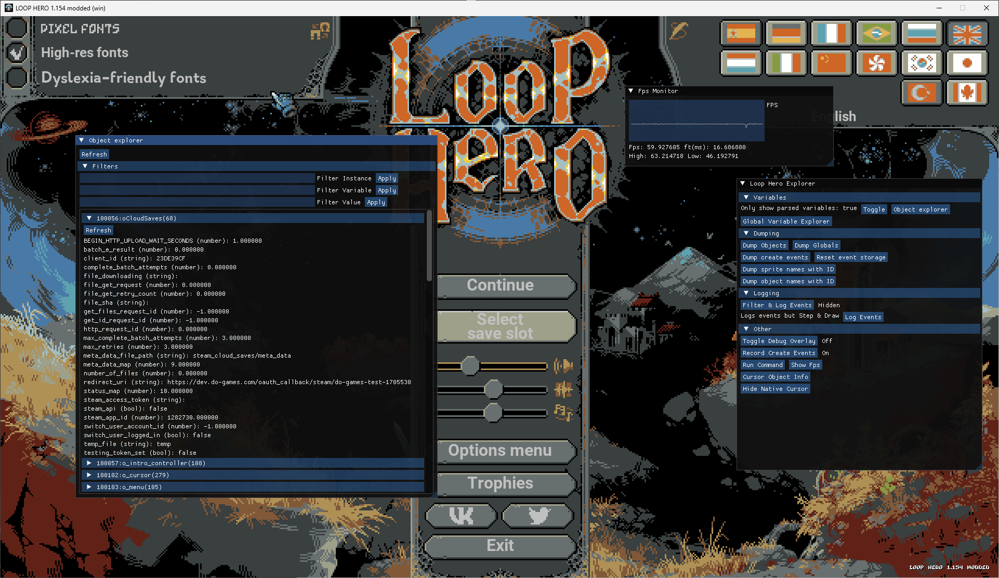

# Loop Hero Explorer

Using imgui, shows various utilities to datamine the game.

Features:
- Object variable explorer
- Global variable explorer
- Run GML commands
- FPS performance measurement
- Dump sprite & object indices

For the variable and instance explorer, filtering instances by name and variables by name and value is possible.
